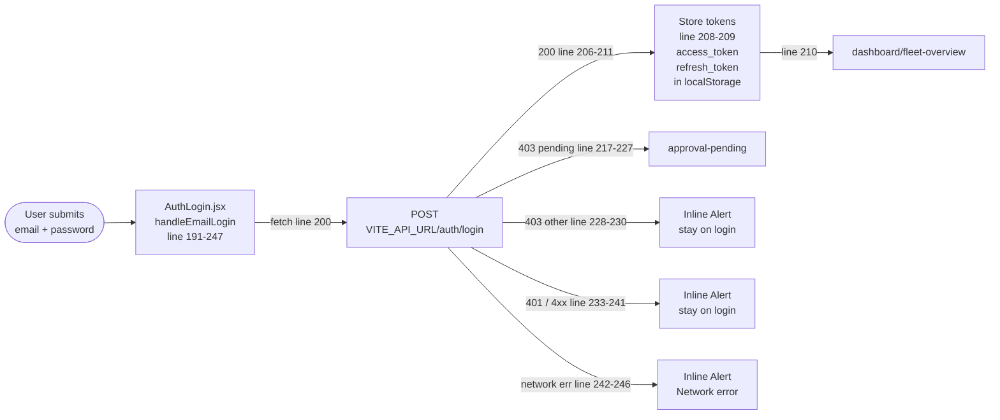
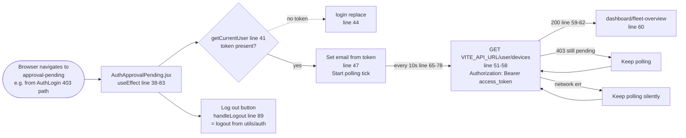
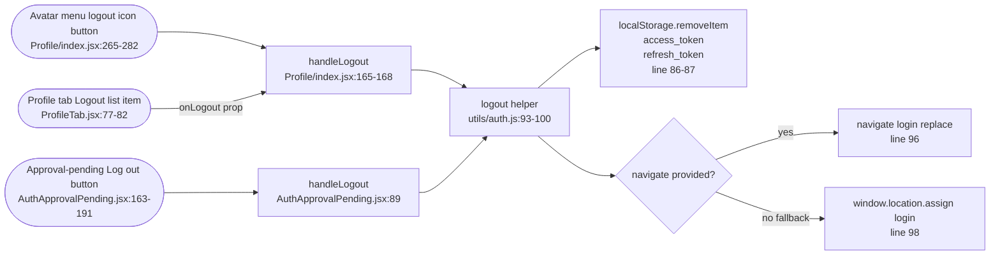

# Authentication — Login Integration Report

**Subsystem:** PheNode V3 frontend ↔ phenodeX backend auth router
**Audience:** Engineers picking up or reviewing the auth flow
**Status:** Email/password login wired end-to-end against the live backend; Google OAuth still requires the `/oauth/callback` page before it can be enabled.

---

## 1. Summary

The phenodeX auth router has been re-verified and now exposes a full set of
authentication endpoints. The V3 login form (`src/sections/auth/AuthLogin.jsx`)
has been wired to the real backend `POST /api/auth/login` endpoint. Successful
sign-ins persist tokens to `localStorage` and route the user into the
dashboard. Unapproved or invalid sign-ins are surfaced with the appropriate
UX: pending-approval users land on the polling page, bad credentials show an
inline error.

---

## 2. Backend Surface (phenodeX)

The auth router (`phenode_backend/api/auth/routes.py`) currently exposes:

| Method | Path                       | Purpose                                                                 | Notable responses |
| ------ | -------------------------- | ----------------------------------------------------------------------- | ----------------- |
| POST   | `/api/auth/login`          | Email + password sign-in                                                | `200` → `TokenResponse` `{ access_token, refresh_token, token_type: "bearer" }` <br> `401` → invalid email or password <br> `403` → account disabled or pending approval |
| POST   | `/api/auth/signup`         | Email + password account creation                                       | `201` → `SignupResponse`. Super-admin emails auto-approved with tokens; everyone else returns `status: "pending_approval"` with no tokens. |
| POST   | `/api/auth/token`          | Exchange a Google ID token for backend JWTs                             | `200` → `TokenResponse` <br> `403` → `is_approved=false` |
| POST   | `/api/auth/refresh`        | Rotate the JWT pair using a valid refresh token                         | `200` → `TokenResponse` |
| GET    | `/api/auth/google/login`   | Begin Google OAuth (HTTP redirect to Google's consent screen)           | `302` redirect |
| GET    | `/api/auth/google/callback`| Google → backend → frontend handoff (`/oauth/callback?token=…`)         | `302` redirect |

Reference: [`phenodeX/docs/frontend-backend-api.md`](../../phenodeX/docs/frontend-backend-api.md).

---

## 3. Frontend Wiring (V3)

### File: `src/sections/auth/AuthLogin.jsx`

The login form's `handleEmailLogin` now performs a real network call:

```js
const apiBase = import.meta.env.VITE_API_URL || '/api';
const res = await fetch(`${apiBase}/auth/login`, {
  method: 'POST',
  headers: { 'Content-Type': 'application/json' },
  body: JSON.stringify({ email: email.trim().toLowerCase(), password })
});
```

Following submission, the response is dispatched per the matrix in §4.

### Token persistence

On a successful sign-in the access and refresh tokens are written to
`localStorage` under the keys `access_token` and `refresh_token`. This matches
the convention used by the legacy phenodeX `AuthContext` so that downstream
fetcher utilities continue to work without modification once V3 brings them
over.

### Routing

| Result                                       | Destination               |
| -------------------------------------------- | ------------------------- |
| `200` (approved sign-in)                     | `/dashboard/fleet-overview` |
| `403` with `detail` containing `"pending"`   | `/approval-pending`       |
| Any other failure                            | Stays on `/login` with error |

### Error surface

Errors render via an MUI `Alert` styled with the project's critical token
(`var(--critical)`) — `border: 1px solid var(--critical)`, translucent
background, matching icon color. The user can dismiss the alert via the
close affordance. Network errors fall back to "Network error — please try
again."

### Submit affordance

The primary "Login" button is rendered through the project's neon-themed
`ProviderButton` recipe. While the request is in flight:

- Button label changes to **"Signing in..."**
- Button is `disabled` (the `submitting` state flag is held in component state)

The button re-enables in the `finally` block of the request handler so the
control state is correct on both success and failure paths.

---

## 4. Behavior Matrix

| Backend response | Detail / condition                       | Frontend behavior                                                                |
| ---------------- | ---------------------------------------- | -------------------------------------------------------------------------------- |
| `200 OK`         | `TokenResponse` payload                  | Persist `access_token` + `refresh_token` to `localStorage`; navigate to `/dashboard/fleet-overview` (replace history). |
| `401 Unauthorized` | "Invalid email or password"            | Inline themed `Alert` with the backend's `detail`, or "Invalid email or password." fallback. Form remains editable. |
| `403 Forbidden`  | `detail` contains the word "pending"     | Navigate to `/approval-pending` (replace history). The polling page hits `GET /api/user/devices` every 10s and routes onward when the user is approved. |
| `403 Forbidden`  | Other (e.g. account disabled)            | Inline themed `Alert` with the backend's `detail`, or "This account is not allowed to sign in." fallback. |
| Network failure  | `fetch` rejects                          | Inline themed `Alert`: "Network error — please try again." Logged to console. |

---

## 5. Visual flow diagrams

The four diagrams below show the same logic the behavior matrix describes,
plus the adjacent flows (Google handoff, approval polling, logout
convergence). They render as live SVG widgets when this file is opened
in any Mermaid-aware viewer (GitHub, VS Code with the Mermaid extension,
Cowork's markdown renderer with the Mermaid Chart connector enabled, or
mermaid.live).

### 5.1 Login flow — `AuthLogin.jsx` email + password

Fanning out into 200, 403-pending, 403-other, 401, and network paths.



### 5.2 Google sign-in / sign-up flow (currently stubs; planned end-to-end shown dotted)

Solid arrows are the current click stub. Dotted arrows mark the
documented but not-yet-wired round-trip through
`/api/auth/google/login` → `/oauth/callback` → `POST /api/auth/token`.

```mermaid
flowchart LR
  ALG([User clicks<br/>Continue with Google<br/>on AuthLogin or AuthRegister]) --> STUB["Currently:<br/>console.info stub<br/>AuthLogin.jsx:50-55<br/>AuthRegister.jsx:38-43"]

  STUB -.planned.-> GLOG["Browser GET api/auth/google/login<br/>backend redirects to Google consent"]
  GLOG -.planned.-> GCB["Backend GET api/auth/google/callback<br/>exchanges code for google_id_token<br/>redirects to FRONTEND_ORIGIN/oauth/callback?token=..."]
  GCB -.planned.-> CBPAGE["Frontend oauth/callback page<br/>NOT YET BUILT — see TODO in AuthLogin.jsx:43-55"]
  CBPAGE -.planned.-> EXCH["POST api/auth/token<br/>body: google_id_token"]

  EXCH -.200.-> SAVE2["Store tokens in localStorage"]
  SAVE2 --> DASH2["dashboard/fleet-overview"]
  EXCH -.403 pending.-> PEND2["approval-pending"]
```



### 5.3 Approval-pending polling loop

Polls `GET /api/user/devices` every 10 seconds. 403 keeps the loop
running; 200 redirects to the dashboard.



### 5.4 Logout convergence — three click sources, one helper

Every logout affordance funnels through the single `logout(navigate)`
helper in `src/utils/auth.js`, which clears both tokens from
`localStorage` and routes back to `/login`.



---

## 6. Out of scope / not yet wired

- **Google OAuth** — the button hands off to a stub. Real handoff requires:
  1. Pointing the click handler at `${VITE_API_URL}/auth/google/login`.
  2. Adding an `/oauth/callback` route in V3 that reads `?token=…`, calls
     `POST /api/auth/token`, and dispatches via the same matrix as §4.
- **Email/password signup** — the signup page is currently a Google-only CTA.
  The backend supports `POST /api/auth/signup`, so adding a password-based
  signup form is a straightforward follow-up.
- **AuthContext** — token persistence is currently inline (direct
  `localStorage` writes). A V3 `AuthContext` mirroring phenodeX's would
  centralize this and unlock automatic refresh on 401 from protected
  endpoints.

---

## 7. Quick verification steps

1. Run the backend locally (`http://localhost:8000`) with a known
   provisioned email/password user.
2. Set `VITE_API_URL=http://localhost:8000/api` in `phenodeV3/.env.local`.
3. `npm run dev` in `phenodeV3/`, navigate to `/`. The page should redirect
   to `/login`.
4. Submit valid credentials — confirm `localStorage.access_token` and
   `localStorage.refresh_token` are populated and that the page redirects to
   `/dashboard/fleet-overview`.
5. Submit invalid credentials — confirm the inline `Alert` surfaces with the
   backend's `detail`.
6. Submit credentials for a known unapproved user — confirm redirect to
   `/approval-pending`.
