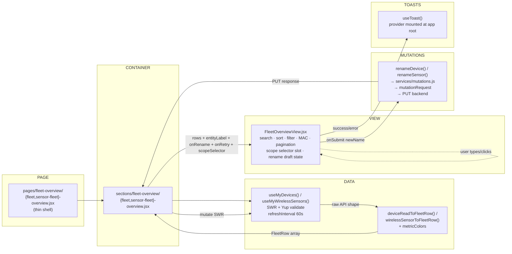
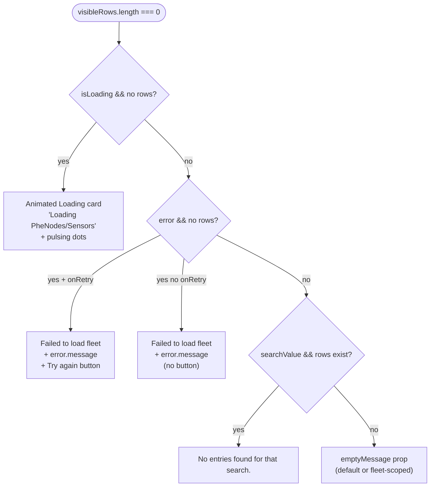
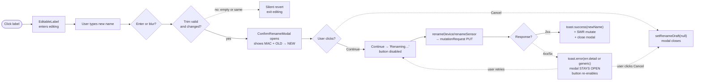
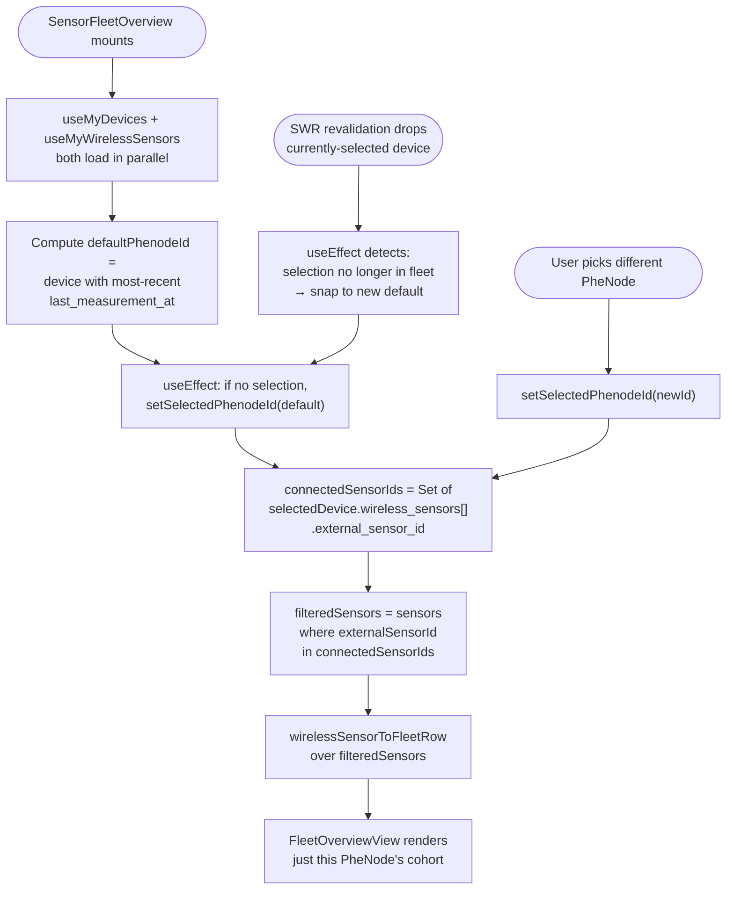
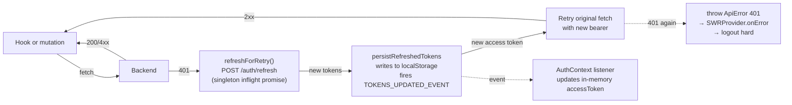

# Fleet Overview — Integration Report

**Subsystem:** PheNode V3 frontend ↔ phenodeX backend device + wireless-sensor APIs
**Audience:** Engineers picking up or reviewing the fleet overview pages
**Status:** Both fleet pages (PheNode + Wireless Sensor) wired end-to-end against the live backend. Rename flow (inline edit → confirm modal → PUT → toast) live for both fleets. Per-card color coding, MAC-mode read-only toggle, and PheNode-scoped sensor filtering all in production. Dev showcase page renders every empty-state and color-tier variant. One backend endpoint (`GET /devices/{id}/wireless-sensors`) confirmed available but not yet wired (returns lean shape; needs richer variant for the perf optimization it was designed to enable).

---

## 1. Summary

The fleet overview subsystem renders two parallel pages — PheNode fleet (`/dashboard/fleet-overview`) and Wireless Sensor fleet (`/dashboard/sensor-fleet-overview`) — both backed by the same presentation component (`FleetOverviewView.jsx`) and differing only at the container layer (`fleet-overview.jsx` vs `sensor-fleet-overview.jsx`).

Both fleets share:

- The same SWR-hook + Yup-validation + pure-transformer data-flow architecture.
- The same card grid, search, A-Z sort, tri-state Status filter, MAC-address display toggle, 20-per-page pagination, and live result count.
- The same inline rename flow (click label → edit → Enter or blur → confirmation modal showing OLD → NEW + read-only MAC → Continue/Cancel → success/error toast).
- The same per-metric color coding rules (Health Status: Active=green / Offline=purple, Battery: ≤30%=critical / ≤50%=orange / >50%=green).
- The same loading / error / empty-fleet / search-empty cascade.
- The same theme tokens (chrome from `themes/sx-tokens.js`).

The Wireless Sensor fleet adds a PheNode scope-selector dropdown (`PhenodeSelector.jsx`) inside the toolbar that filters the visible sensors to the cohort connected to the chosen PheNode — defaulting to the most-recently-reporting PheNode on first load.

---

## 2. Scope of audit

**In scope**:

- `src/pages/fleet-overview/*` — page components (thin shells)
- `src/sections/fleet-overview/*` — containers (`fleet-overview.jsx`, `sensor-fleet-overview.jsx`) + view (`FleetOverviewView.jsx`)
- `src/hooks/data/useMyDevices.js` and `useMyWirelessSensors.js`
- `src/services/{endpoints,fetcher,mutations}.js`
- `src/services/schemas/{device,wirelessSensor}.js`
- `src/utils/transforms/{device,wirelessSensor,metricColors}.js`
- `src/components/{EditableLabel,ConfirmRenameModal,PhenodeSelector}.jsx`
- `src/providers/{SWRProvider,ToastProvider}.jsx`
- `src/pages/dev/fleet-states.jsx` (dev-only state showcase)

**Out of scope**:

- Auth flow (covered by `auth-login-integration-report.md`)
- Drawer / header / nav layout (`src/layout/Dashboard/*`)
- Other dashboard pages (sensor measurements, imaging, system diagnostics, downloads)

---

## 3. Backend Surface (phenodeX)

The fleet overview consumes these endpoints. All require a Bearer access token (the fetcher adds the `Authorization` header automatically and refreshes-and-retries once on 401).

| Method | Path | Purpose | Notable responses |
| ------ | ---- | ------- | ----------------- |
| GET    | `/api/devices/my-devices`                            | List all PheNodes the user has access to.                                | `200` → `DeviceRead[]` (snake_case fields incl. `external_device_id`, `label`, `last_measurement_at`, `health_status`, `temperature_c`, `battery_percent`, `wireless_sensors[]`) |
| PUT    | `/api/devices/{external_device_id}`                  | Update device label (fleet rename).                                      | `200` → `{ success, device: {id, external_device_id, label} }` <br> `400` → `Label must not be empty` <br> `404` → `Device not found` <br> `409` → `Label already exists` (DB UNIQUE constraint) |
| GET    | `/api/wireless-sensors/my-sensors`                   | List all wireless sensors the user has access to (richer shape now — summary fields per sensor populated server-side via batched latest-readings query). | `200` → `{ success, sensors: WirelessSensorListItem[] }` (camelCase aliases incl. `_id`, `externalSensorId`, `label`, `lastMeasurementAt`, `healthStatus`, `batteryPercent`, `soilMoisture`, `soilTemperatureC`, `rssi`) |
| PUT    | `/api/wireless-sensors/{external_sensor_id}`         | Update sensor label.                                                     | `200` → `{ success, sensor: {_id, externalSensorId, label} }` <br> `400` → `Label must not be empty` <br> `404` → `Sensor not found` <br> `409` → `Label already exists` (UNIQUE constraint added in recent migration) |
| GET    | `/api/devices/{external_device_id}/wireless-sensors` | NEW — the connected-sensor list for one PheNode (lean shape).            | `200` → `AdminDeviceWirelessSensorRead[]` (`id`, `external_sensor_id`, `label`). NOT YET WIRED into V3 — see §10 for why. |

References:

- `phenodeX/phenode_backend/api/devices/routes.py` (devices router)
- `phenodeX/phenode_backend/api/wireless_sensors/routes.py` (wireless-sensor router)
- `phenodeX/docs/frontend-backend-api.md` (full contract)

---

## 4. Frontend Architecture Overview

The data flow is the same on both fleet pages — only the hooks and transformers differ. Single direction, no shared state between fleets:

```
                   ┌─────────────────────────────────────────────┐
                   │           PHENODE FLEET PAGE                │
                   │       /dashboard/fleet-overview             │
                   └──────────────────┬──────────────────────────┘
                                      │
                          pages/fleet-overview/fleet-overview.jsx (thin shell)
                                      │
                                      ▼
              sections/fleet-overview/fleet-overview.jsx (CONTAINER)
                                      │
                ┌─────────────────────┼──────────────────────┐
                │                     │                      │
                ▼                     ▼                      ▼
        useMyDevices()         useAuth()            renameDevice()
                │                     │                      │
                ▼                     ▼                      ▼
        DeviceRead[]            accessToken          PUT mutation
                │                                            │
                ▼                                            │
        deviceReadToFleetRow                                 │
        (utils/transforms/device.js)                         │
                │                                            │
                ▼                                            │
        FleetRow[] {siteName, externalId,                    │
        lastMeasurements, lastMeasurementAt,                 │
        metrics:[{label, value, color?}]}                    │
                │                                            │
                └──────────────────┬─────────────────────────┘
                                   │
                                   ▼
                    sections/fleet-overview/FleetOverviewView.jsx (VIEW)
                                   │
              ┌────────────────────┼─────────────────────┐
              │                    │                     │
              ▼                    ▼                     ▼
        Renders cards    Manages search/sort/    Owns rename modal
        (or empty card)   filter/MAC/page       state + toast call
                                state               site
```

The Wireless Sensor fleet page is identical except:

- `useMyWirelessSensors()` returns `WirelessSensorListItem[]` (camelCase from the backend's pydantic alias schema).
- `wirelessSensorToFleetRow` transforms it to the same generic `FleetRow` shape.
- `renameSensor()` is the mutation.
- `useMyDevices()` is ALSO called (for the PheNode selector dropdown), and a `PhenodeSelector` element is passed to `FleetOverviewView` via the `scopeSelector` prop.
- Sensors are filtered to the cohort connected to the selected PheNode before being transformed.

---

## 5. Component Inventory

### 5.1 Pages (thin shells)

| File | Purpose |
| ---- | ------- |
| `src/pages/fleet-overview/fleet-overview.jsx`        | Renders `<FleetOverview />` from `sections/`. |
| `src/pages/fleet-overview/sensor-fleet-overview.jsx` | Renders `<SensorFleetOverview />` from `sections/`. |
| `src/pages/dev/fleet-states.jsx`                     | Dev-only showcase. Renders `FleetOverviewView` 8 times with hand-crafted props for every empty-state cascade variant + color tier verification. Route gated to `import.meta.env.DEV` in `routes/MainRoutes.jsx`. |

### 5.2 Containers (data-fetching)

| File | Responsibility |
| ---- | -------------- |
| `src/sections/fleet-overview/fleet-overview.jsx`        | Calls `useMyDevices()`, transforms via `deviceReadToFleetRow`, wires `renameDevice` mutation, passes `entityLabel="PheNodes"` to the view. |
| `src/sections/fleet-overview/sensor-fleet-overview.jsx` | Calls both `useMyWirelessSensors()` and `useMyDevices()`. Owns `selectedPhenodeId` state with most-recent-reporter default. Filters sensors by selected PheNode's `wireless_sensors[]` cohort before transformation. Passes `<PhenodeSelector />` via `scopeSelector` prop. |

### 5.3 View (presentation)

| File | Responsibility |
| ---- | -------------- |
| `src/sections/fleet-overview/FleetOverviewView.jsx` | Renders the entire fleet UI: title row, optional scope selector, toolbar (search + A-Z + Status filter + MAC toggle), card grid, pagination, live "Showing X of Y" count, scroll-aware top border, scroll-edge fade mask. Owns search/sort/filter/page/MAC/scroll/rename-draft state. Mounts `ConfirmRenameModal`. Calls `useToast()`. |

### 5.4 Hooks (read side)

| File | Returns |
| ---- | ------- |
| `src/hooks/data/useMyDevices.js`         | `{ devices, isLoading, error, mutate }` — SWR'd against `/api/devices/my-devices`, validated with `services/schemas/device.js`, refreshInterval 60s. |
| `src/hooks/data/useMyWirelessSensors.js` | `{ sensors, isLoading, error, mutate }` — SWR'd against `/api/wireless-sensors/my-sensors`, validated with `services/schemas/wirelessSensor.js`, refreshInterval 60s. The validator unwraps the `{ success, sensors: [...] }` envelope so the hook surface stays parallel with `useMyDevices`. |

### 5.5 Services (write side + utilities)

| File | Exports |
| ---- | ------- |
| `src/services/endpoints.js`        | URL catalog (`API.devices.myDevices`, `API.devices.update(id)`, `API.wirelessSensors.mySensors`, `API.wirelessSensors.detail(id)`, etc.). Single source of truth for backend paths. |
| `src/services/fetcher.js`          | `fetcher(key)` for SWR (GET only); `mutationRequest(url, {method, body, token})` for PUT/POST/DELETE. Both share the 401-auto-refresh-and-retry behavior via a singleton inflight-refresh promise. `ApiError` class carries `.status` + `.detail`. |
| `src/services/mutations.js`        | `renameDevice(externalId, label, accessToken)` and `renameSensor(externalId, label, accessToken)`. Both call `mutationRequest` under the hood. |
| `src/services/schemas/device.js`   | Yup validator for the `/devices/my-devices` response shape. Throws `ValidationError` (caught by SWR's `error`) on backend contract drift. |
| `src/services/schemas/wirelessSensor.js` | Yup validator for the wrapped sensor list response. Returns the unwrapped array on success. |

### 5.6 Pure transformers

| File | Maps |
| ---- | ---- |
| `src/utils/transforms/device.js`         | `DeviceRead → FleetRow`. Translates `Live → Active` for the health status display. Attaches per-metric colors via `metricColors`. |
| `src/utils/transforms/wirelessSensor.js` | `WirelessSensorListItem → FleetRow`. Same `Live → Active` translation + color attachment. Soil temp Celsius → Fahrenheit for display. |
| `src/utils/transforms/metricColors.js`   | `healthStatusColor(value)` and `batteryColor(percent)`. Single source of truth for the color rules across both fleets. |

### 5.7 Reusable components (this subsystem)

| File | Purpose |
| ---- | ------- |
| `src/components/EditableLabel.jsx`     | Click-to-edit label. Idle: Typography + hover-revealed pencil icon, cursor pointer. Editing: OutlinedInput with rename-TextField chrome. Submit on Enter or blur. Validation: trim, reject empty, reject equal-to-current → silent revert. `locked` prop disables the editable behavior (used when MAC mode is on or no `onRename` is provided). |
| `src/components/ConfirmRenameModal.jsx` | Themed MUI Dialog. Shows MAC (read-only), OLD → NEW transition, Continue/Cancel buttons. Continue button has loading state during async `onConfirm`. Modal stays open on error so user can retry. Backdrop blur(6px). |
| `src/components/PhenodeSelector.jsx`   | MUI Autocomplete styled to match the rename TextField pattern from `sensor-network.jsx`. Used by the sensor fleet to pick which PheNode's connected sensors to display. |

### 5.8 Providers

| File | Provides |
| ---- | -------- |
| `src/providers/SWRProvider.jsx`   | Global SWR config: persistent localStorage cache wiped on logout, dedup 15s, no focus revalidation, 401 → hard-logout, `keepPreviousData: true` so silent token rotation doesn't flash a "Loading…" card. |
| `src/providers/ToastProvider.jsx` | Mounted at app root in `routes/index.jsx`. Exposes `useToast()` hook with `success(msg)` and `error(msg)` methods. Renders MUI Snackbar bottom-right, 4s auto-hide, themed to match `tooltipSlotProps`. |

---

## 6. Feature Surface

### 6.1 Both fleets

- **Card grid** — each row renders a card with: site name (left), "Last measurements taken" + date (right), 5-column metric grid below (collapses to 3 on sm, 2 on xs).
- **Search** — magnifying-glass icon expands an inline search input. Filters the card list across `siteName`, `externalId`, `lastMeasurements`, and every metric `label/value`. Works across all pages (filter runs before pagination).
- **A-Z sort toggle** — when on, sorts cards by current displayed title (`siteName` or `externalId`, depending on MAC mode). When off, default is most-recent-first by `lastMeasurementAt`.
- **Status filter (tri-state)** — cycles `Status (no filter) → Active (filter to alive cohort) → Offline (filter to offline cohort) → Status …`. Header counter updates: rest = "Total {Entity}: N", Active = "{Entity} Active: N", Offline = "{Entity} Offline: N".
- **MAC Address toggle** — flips card titles between user-set label (default) and immutable `external_id`. Disables the rename affordance when on (the immutable id is read-only by definition). Search still includes `externalId` regardless of display mode.
- **Inline rename** — click any card's site name → input replaces the label → Enter/blur → confirmation modal → Continue → PUT → success toast + SWR revalidate, OR Cancel → modal closes, no change. Disabled when MAC mode is on. Modal shows the immutable MAC for verification.
- **Pagination** — 20 cards per page. Pagination control hidden when total ≤ 20 (single page). Resets to page 1 when search/sort/filter changes. Auto-scrolls to top on page change.
- **Live "Showing X of Y" count** — bottom-right under the table. X = filtered/sorted set size, Y = total fleet size.
- **Loading / error / empty cascade** — see §7.
- **Color-coded values** — see §8.

### 6.2 Wireless Sensor fleet only

- **PheNode scope selector** — dropdown in the toolbar (left of search) labeled "Showing sensors connect to:". Auto-defaults to the most-recently-reporting PheNode on first load. Switching PheNodes refilters the visible sensors to the new cohort. Empty message updates to "No wireless sensors connected to this PheNode yet." when a PheNode is selected but has no connected sensors.

---

## 7. Behavior Matrix — Empty-State Cascade

The view's `renderEmptyStateCard` function in `FleetOverviewView.jsx` cascades through these conditions in order; first match wins.

| State | Condition | Renders |
| ----- | --------- | ------- |
| Loading first time | `isLoading && (!rows || rows.length === 0)` | Animated "Loading {entityLabel}…" card with three pulsing dots (`pheno-loading-dot` keyframe, opacity 0.25 ↔ 1.0 with stagger delay). Larger text (variant=h5), green color, glow shadow. |
| Failed first load + retry | `error && (!rows || rows.length === 0) && onRetry` | "Failed to load fleet" headline (orange, bold) + error.message in muted italic + "Try again" button styled like the toolbar buttons, calls `onRetry` prop. |
| Failed first load no retry | Same as above but `onRetry` omitted | Same headline + message, button hidden. |
| Search returned zero | `searchValue && rows && rows.length > 0` | "No entries found for that search." Soft message, blue text. |
| Empty fleet | All other paths through the cascade | `emptyMessage` prop string (default "No devices in your fleet yet.", overridden per fleet to "No PheNodes assigned to your account yet." / "No wireless sensors assigned to your account yet." or PheNode-scoped variant). |

**Border behavior during these states**: top + bottom border on the scroll wrapper hide entirely when `rows` is empty/undefined (a bordered "table" framing an inert "Loading…" message reads as a UI error). Borders re-appear once data is present.

---

## 8. Color Coding Rules

Source of truth: `src/utils/transforms/metricColors.js`. Both transformers import and apply.

| Metric | Condition | Color |
| ------ | --------- | ----- |
| Health Status | `Active` (translated from backend's `Live`) | `var(--green)` |
| Health Status | `Offline` | `var(--purple)` |
| Health Status | Anything else (`Unknown`, missing, '') | `var(--green)` (fallback) |
| Battery | `≤30%` | `var(--critical)` |
| Battery | `31-50%` | `var(--orange)` |
| Battery | `51-100%` | `var(--green)` |
| Battery | `null`, `undefined`, `NaN` | `var(--green)` (fallback) |
| Other metrics | — | `var(--green)` (default) |

Why missing battery falls back to green rather than red: a sensor that hasn't reported yet shouldn't scream "critical battery!" because absence of data is a different problem than a confirmed low reading. Surfacing red on missing data would read as a false positive.

The view applies a softened `textShadow` for purple text (`0 1px 5px #1a75e060` instead of the default `0 1px 9px #1a75e0c9`) so the Offline state doesn't visually overpower the Active values around it.

---

## 9. Behavior Matrix — Rename Flow

| User action | Frontend response |
| ----------- | ----------------- |
| Click site name (label mode, parent supplies `onRename`) | `EditableLabel` enters editing state. Input replaces Typography, autofocused, prefilled with current label. |
| Click site name (MAC mode OR no `onRename`) | No-op. Cursor stays default, no pencil shown, no edit triggered. |
| Type a new name + Enter | `EditableLabel.trySubmit()` runs. Trim → reject empty/unchanged → silent revert; otherwise `onSubmit(trimmed)` fires. View sets `renameDraft = { externalId, oldName, newName }`. Modal opens. |
| Type then click away (blur) | Same as Enter. `submittedRef` guard prevents double-fire if Enter triggered first. |
| Press Escape while editing | Cancels edit, reverts to label, no submit. |
| Click Cancel in modal | `setRenameDraft(null)` closes modal. No mutation. |
| Click Continue in modal | Modal flips Continue to "Renaming…" + disabled. View calls `onRename(externalId, newName)` → container calls `renameDevice/renameSensor` → `mutationRequest` PUTs the backend. |
| Mutation succeeds | View fires `toast.success("'{newName}' renamed successfully")`. Container's `mutate()` revalidates the SWR cache. View clears `renameDraft` to close modal. |
| Mutation fails (`ApiError`) | View fires `toast.error("Failed to rename {entity}: {err.detail}")` if `err.detail` is a string (e.g., backend's `"Label already exists"`), otherwise generic `"Failed to rename {entity}"`. Modal STAYS OPEN — Continue button re-enables (its `finally` resets `isSubmitting`), user can retry without re-typing the new name, or click Cancel to abandon. |

---

## 10. Backend perf optimization status

The wireless sensor fleet currently fetches the entire account-wide sensor list (`GET /api/wireless-sensors/my-sensors`) and filters client-side to the selected PheNode's cohort. On accounts with many PheNodes, the response payload is larger than necessary.

The new endpoint `GET /api/devices/{external_device_id}/wireless-sensors` (verified live in `phenode_backend/api/devices/routes.py:532`) was designed to enable a server-side scoped fetch, but as currently shaped returns `AdminDeviceWirelessSensorRead[]` — a lean shape carrying only `id`, `external_sensor_id`, `label`. The fleet cards need the rich `WirelessSensorListItem` shape (`lastMeasurementAt`, `healthStatus`, `batteryPercent`, `soilMoisture`, `soilTemperatureC`, `rssi`).

Wiring the lean endpoint into the frontend would replace the in-memory filter with a network round-trip for the same information, with no payload reduction (each device's `wireless_sensors[]` already carries the same fields the lean endpoint returns).

The optimization the user originally wanted requires extending this endpoint to return the rich shape — either via a `?detail=true` query parameter on the existing route, or a parallel `/connected-sensors-detail` route. Until that lands, the current client-side filter remains the right architecture.

---

## 11. Visual flow diagrams

### 11.1 Fleet page data flow

Same shape on both fleets — different hooks, transformers, mutation function names.



### 11.2 Empty-state cascade (renderEmptyStateCard)



### 11.3 Rename flow

Solid arrows: happy path. Dotted: error or cancel paths.



### 11.4 PheNode scope filter (sensor fleet only)



### 11.5 401 auto-refresh-and-retry (shared with read path)



---

## 12. State management decisions

| Concern | Where it lives | Why |
| ------- | -------------- | --- |
| Server data (devices, sensors) | SWR cache (per-key) | Auto-deduped, persisted to localStorage, revalidated on a 60s interval. `keepPreviousData: true` so silent token rotation doesn't flash "Loading…". |
| Auth tokens | `AuthContext` + localStorage | In-memory state for synchronous reads, localStorage for persistence across reloads. Synchronized via a custom `TOKENS_UPDATED_EVENT` (native `storage` event only fires cross-tab). |
| Search / sort / filter / page / MAC / scroll-from-top / rename draft | `FleetOverviewView` local state | All transient UI state. Each fleet page is independent; no cross-page synchronization needed. |
| Selected PheNode (sensor fleet only) | `SensorFleetOverview` container state | Auto-defaults to most-recently-reporting; auto-clamps if selection disappears from the fleet. |
| Rename modal open/closed | `FleetOverviewView` (`renameDraft` is non-null = open) | Single piece of state instead of separate flags; can never be in a half-open "open=true but no name" state. |
| Toast queue | `ToastProvider` | Single global instance. One toast at a time; firing a new one replaces the previous. Migration path to `notistack` for stacked toasts is a swap of internals only — `useToast()` API stays the same. |

---

## 13. Theme + chrome vocabulary

All visual chrome leans on `src/themes/sx-tokens.js`:

- `glassSurfaceSx`, `reflectedCardChromeSx` — MainCard wrapper.
- `tooltipSlotProps` — Tooltip styling vocabulary, also used for the toast surface.
- `neonControlSx`, `neonMenuPaperSx`, `neonMenuItemSx` — PhenodeSelector dropdown chrome.
- `drawerNavButtonSurfaceSx` — Toolbar button surface.

Per-component locally-defined sx (in `FleetOverviewView.jsx`):

- `controlBaseSx` — Search icon button + sort/filter ToggleButtons base.
- `sortToggleSx` — A-Z, Status, MAC button hover/selected treatment.
- `paginationSx` — MUI Pagination chrome.
- `truncateLineSx` — Whitespace nowrap + overflow hidden + textOverflow ellipsis + minWidth 0.
- `searchInputSx` — Search OutlinedInput chrome (matches the rename TextField pattern in `sensor-network.jsx`).

CSS variables consumed: `--blue`, `--green`, `--purple`, `--orange`, `--critical`, `--reflected-light`, `--box-outline-blue`, `--dark-blue`, `--drf`.

---

## 14. Out of scope / not yet wired

- **Rich scoped-sensor endpoint** — see §10. The current architecture filters in-memory after fetching the full sensor list; the perf optimization is blocked on backend.
- **Card click → detail page** — cards have hover styles that imply clickability (cursor pointer, green left/right border on hover) but no `onClick` is wired. Could route to a sensor/device detail page in a follow-up.
- **Card keyboard accessibility** — if cards become clickable, they need `role="button"`, `tabIndex={0}`, and Enter/Space handlers. Not done because the click target isn't wired yet.
- **Optimistic rename** — current implementation is pessimistic (waits for server response). With confirmation modal in the flow, the round-trip is invisible to the user, so optimistic adds complexity without UX gain.
- **Stacked toasts** — `notistack` migration if firing multiple operations in rapid succession becomes a real use case.
- **Card hover → click affordance vs MAC mode visual** — a card in MAC mode reads as plain text (no pencil), but the hover-card-treatment still implies clickability. May want to soften the hover styling globally if the card-click path is removed.
- **Server-side rename validation surfacing** — backend now returns 409 for duplicate labels on both fleets (recent migration added the UNIQUE constraint to wireless_sensors.label). Toast plumbing already pipes `err.detail` through, so messages like "Label already exists" appear automatically.

---

## 15. Quick verification steps

1. **Boot the app locally** — `cd phenodeV3 && npm run dev`. Log in with a test account.

2. **PheNode fleet page** — navigate to `/dashboard/fleet-overview`. Verify cards render with correct color coding (Health Status green/purple; Battery green/orange/red by tier). Click a card label, type a new name, press Enter, confirm in modal, verify success toast + card label updates.

3. **Wireless Sensor fleet page** — navigate to `/dashboard/sensor-fleet-overview`. Verify the PheNode dropdown auto-populates to your most-recently-reporting PheNode. Switch PheNodes and verify the visible sensor cohort changes. Try the rename flow on a sensor.

4. **Rename failure path** — rename a PheNode to a label that already exists on another PheNode. Verify error toast says `"Failed to rename phenode: Label already exists"` and modal stays open. Same test on sensors should now also work (constraint added in recent migration).

5. **Empty + loading + error states** — navigate to the dev showcase at `/dashboard/dev/fleet-states`. Verify all 8 sections render correctly: 2 loading variants, 2 error variants (with/without retry), 2 empty fleet variants (PheNodes/Sensors), search-filtered-to-zero, and happy path with mock rows that exercise every color tier.

6. **Search + filter combinations** — on either fleet: type something into search, verify card list filters across all pages. Click A-Z, verify sort. Cycle Status filter through Active/Offline. Toggle MAC mode and verify labels swap to external IDs and rename is disabled.

7. **MAC mode in modal** — start a rename, verify the modal shows the read-only MAC at the top in monospace. Try clicking the MAC — it should not be editable (cursor stays default, `userSelect: 'all'` lets you copy it).

8. **Token rotation invisible** — leave the page open in a background tab for >15 minutes (token expiry window depends on backend config). Switch back. Verify NO "Loading…" flash — the cards stay on screen with `keepPreviousData` while the silent refresh + revalidation happens.

---

## 16. Related artifacts

- **Project tracker — Tests tab — "Fleet Overview UI State Testing"**: live artifact entry covering the dev showcase page and the color-coding rules verification. Working copy at `~/Coding/PheNode/Outputs/tracker/index.html`; sync via `mcp__cowork__update_artifact` (id: `phenode-project-tracker`).
- **Auth login integration report**: `phenodeV3/docs/auth-login-integration-report.md` — sister document covering the auth flow this fleet page sits behind.
- **Refactor report**: `phenodeV3/docs/REFACTOR_REPORT.md` — historical context on the V3 architecture decisions (containers vs hooks vs transformers vs view).
- **Lighthouse baseline**: `phenodeV3/docs/Lighthouse/baseline.md` — perf baseline; useful for re-measuring after the rich scoped-sensor endpoint lands.
